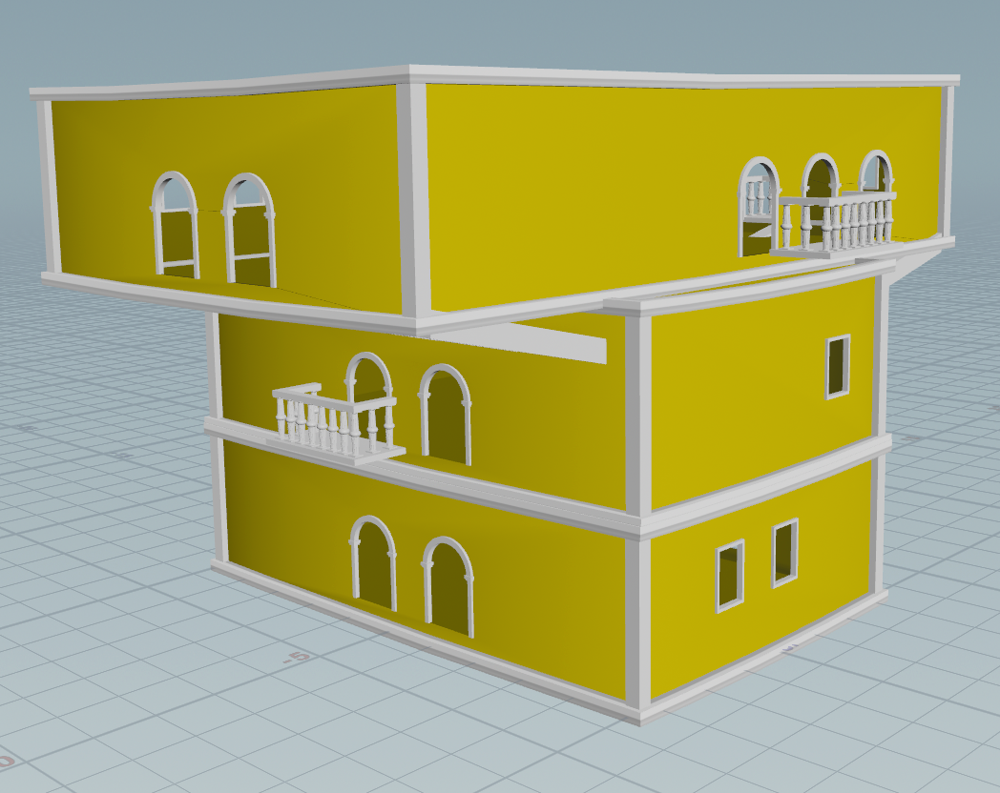

# Casa
Casa is a procedural house generator built in Houdini and based on the colorful houses within the "Ciudad Amurallada" (Walled City) of Cartagena, Colombia. 

The generator procedurally places a spanish-style balcony, archways, and windows along the building's facade and allows the user control over the dimensions of each floor

## Demo
https://github.com/user-attachments/assets/c5b8c8bc-3dfe-40c8-a4c3-e9e4c35ac87c

## Reference

Features:
- Colorful base color
- Defined spandrels and archways
- Rectangular balconies with column-adorned railings
- Plantlife overgrowing 

Asset List:
- Column
- Balcony Railing
- Plants
- Walls
- Tiled Corners

