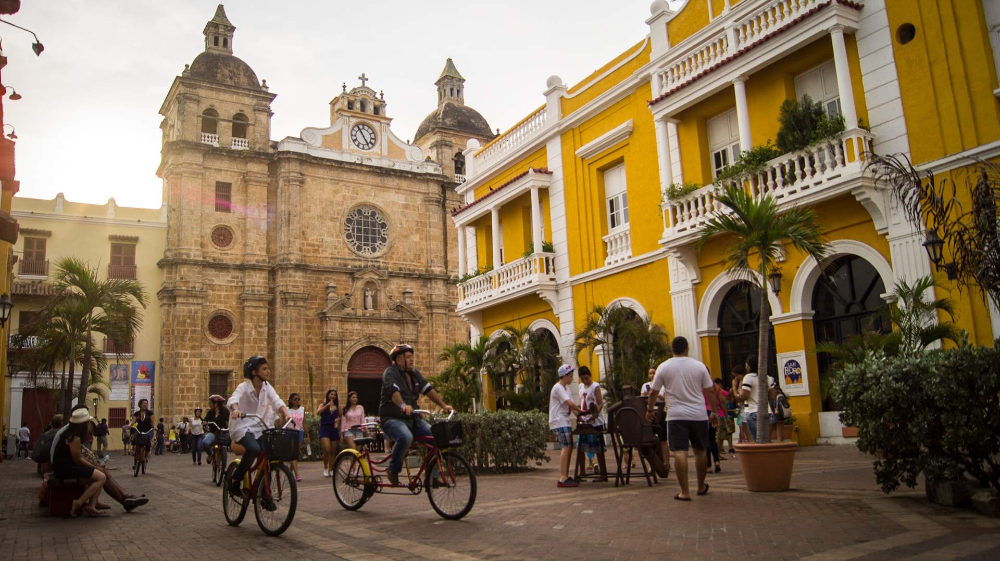
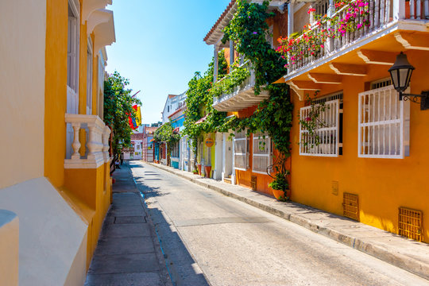
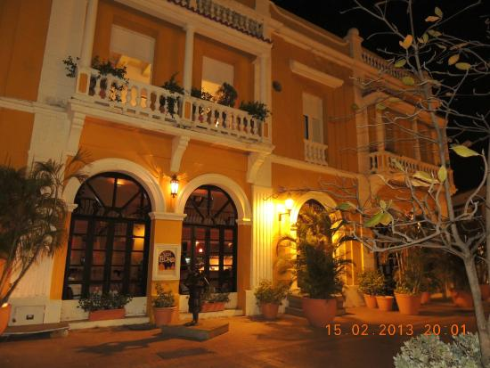

Target Style: Cartagena Walled City

Features:
- Colorful base color
- Defined spandrels and archways
- Rectangular balconies with column-adorned railings
- Plantlife overgrowing 

Asset List:
- Column
- Balcony Railing
- Plants
- Walls
- Tiled Corners

